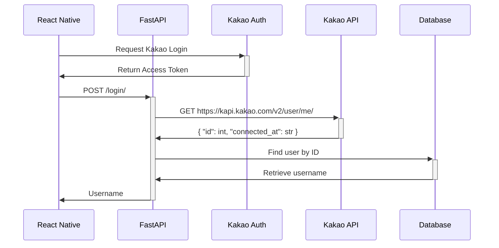

React Native / FastAPI demo project for testing [Kakao Login](https://developers.kakao.com/docs/latest/ko/kakaologin/common#intro) with [@react-native-seoul/kakao-login](https://github.com/crossplatformkorea/react-native-kakao-login).

## Flow


### Request Formats
**1. React Native to FastAPI**

Pass access token received from Kakao authorization server to FastAPI via POST method.
```json
{
    "access_token": "{token_value}"
}
```

**2. FastAPI to Kakao API**

Fetch user information from Kakao API server via GET method and include headers in the below.

|Key|Value|
|-|-|
|Authorization|`Bearer {token_value}`|
|Content-Type|`application/x-www-form-urlencoded;charset=utf-8`|