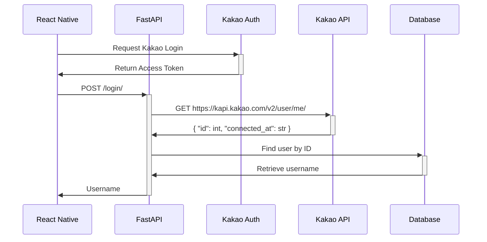

React Native / FastAPI demo project for testing [Kakao Login](https://developers.kakao.com/docs/latest/ko/kakaologin/common#intro) with [@react-native-seoul/kakao-login](https://github.com/crossplatformkorea/react-native-kakao-login).

## Flow

